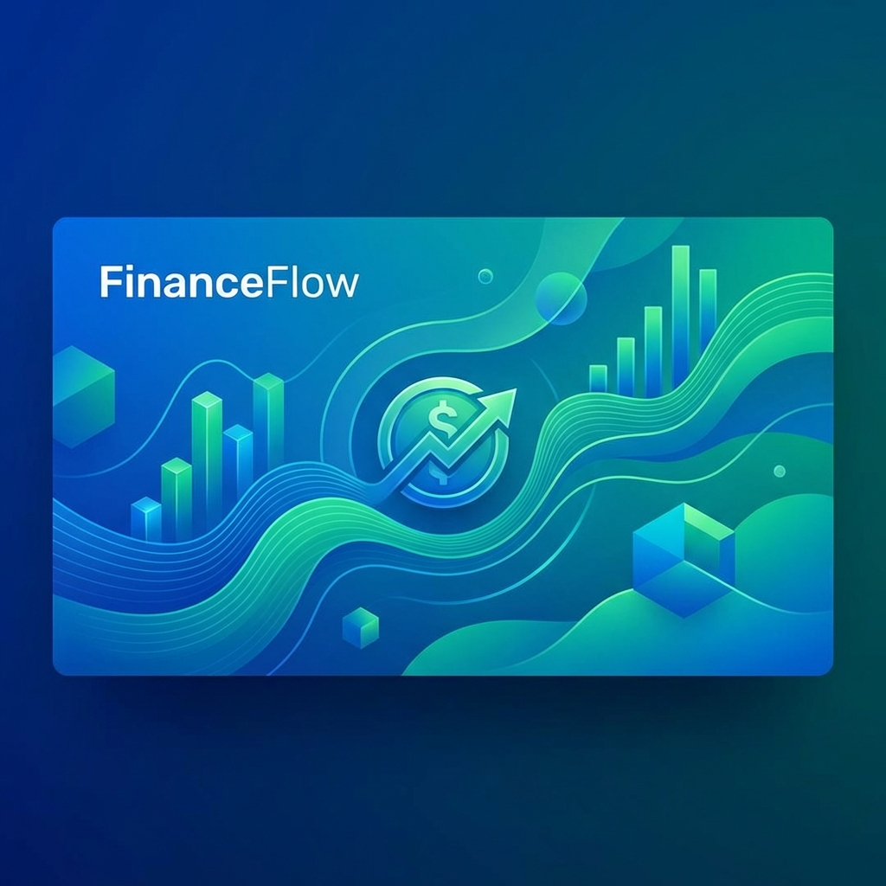

<div align="center">
  

  # ✨ FinanceFlow
  ### *Student Budget Playground*
  
  **Master your money with ease. Visualize your spending, plan your savings, and build better financial habits.**

  [Features](#-key-features) • [Tech Stack](#-tech-stack) • [Installation](#-quick-start) • [The 50/30/20 Rule](#-the-503020-rule)
</div>

---

## 🚀 Overview

**FinanceFlow** is a modern, interactive budgeting tool designed specifically for students and young professionals. It takes the guesswork out of financial planning by providing a "playground" where you can experiment with different income levels and spending allocations in real-time.

## 🌟 Key Features

- **💰 Dynamic Income Tracking:** Input your monthly earnings and see how every dollar counts.
- **🎚️ Interactive Allocations:** Use intuitive sliders to split your budget into *Needs*, *Wants*, and *Savings*.
- **📊 Real-time Visualization:** Watch your budget transform instantly with dynamic Pie Charts powered by Recharts.
- **📈 Savings Projection:** Visualize your long-term wealth growth with detailed 6-month and 1-year projections.
- **💾 Local Persistence:** Your data stays with you! All settings are saved automatically to your browser's local storage.
- **📱 Fully Responsive:** Access your budget playground from any device with a clean, mobile-first design.

## 🛠️ Tech Stack

- **Framework:** [React 19](https://react.dev/)
- **Build Tool:** [Vite](https://vitejs.dev/)
- **Icons:** [Lucide React](https://lucide.dev/)
- **Charts:** [Recharts](https://recharts.org/)
- **Styling:** [Tailwind CSS](https://tailwindcss.com/)
- **Language:** [TypeScript](https://www.typescriptlang.org/)

## 📚 The 50/30/20 Rule

FinanceFlow encourages the popular **50/30/20 budgeting strategy**:
- **50% Needs:** Essential costs like rent, groceries, and utilities.
- **30% Wants:** Non-essentials like dining out, hobbies, and entertainment.
- **20% Savings:** Investing in your future, emergency funds, and debt repayment.

*Adjust the sliders to see how your unique lifestyle fits this proven model!*

## 🏁 Quick Start

### Prerequisites
- [Node.js](https://nodejs.org/) (Latest LTS recommended)

### Installation

1. **Clone or Download the project**
   ```bash
   git clone <your-repo-url>
   cd financeflow
   ```

2. **Install Dependencies**
   ```bash
   npm install
   ```

3. **Set up Environment**
   Create a `.env.local` file and add any necessary keys (e.g., Gemini API key if applicable).

4. **Run Development Server**
   ```bash
   npm run dev
   ```

5. **Build for Production**
   ```bash
   npm run build
   ```

## 🔒 Privacy

Your financial data is private. FinanceFlow processes and stores all information locally in your browser. No data is sent to external servers unless explicitly configured by you.

---

<div align="center">
  Built with ❤️ for better financial futures.
</div>
